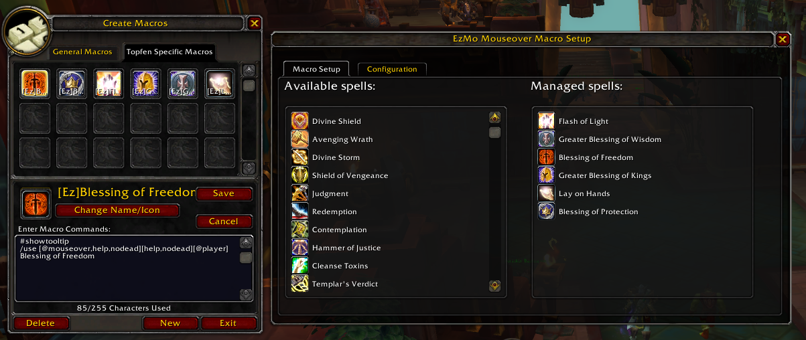

# EzMo

This is a simple addon that allows you to automatically generate mouseover macros. It is mainly aimed at
healers who do not use VuhDo or Healbot and prefer simple mouseover macros with whatever raid frames
they prefer. Since the macro text is configurable, it can be used for other purposes too (let me know
if you do that!).

## Usage

Open the configuration menu with `/ezmo`. Click spells in the list of available actives to add them to
your managed macros. The macro will be generated automatically, and the spell in your bars will be swapped
to the macro.

Click spells in the list of managed spells to remove them. The macro will be deleted and any macros on your
hotbars will be replaced with the basic spell.

## Configuration

The macro text can be configured using the configuration tab. The placeholder `{spell}` contained in the macro 
text will be replaced with the spell's name when the macro is generated. The placeholder will be replaced
multiple times, should it occur more than once. Currently, all settings (the macro text and the managed spells)
are saved per-character, with no option to select cross-character profiles. Let me know if you need that.

## Acknowledgements

This addon was inspired by Adrien Chaix' [Macro MouseOver](https://www.curseforge.com/wow/addons/mouseover), but
was re-written from scratch with configurability in mind.